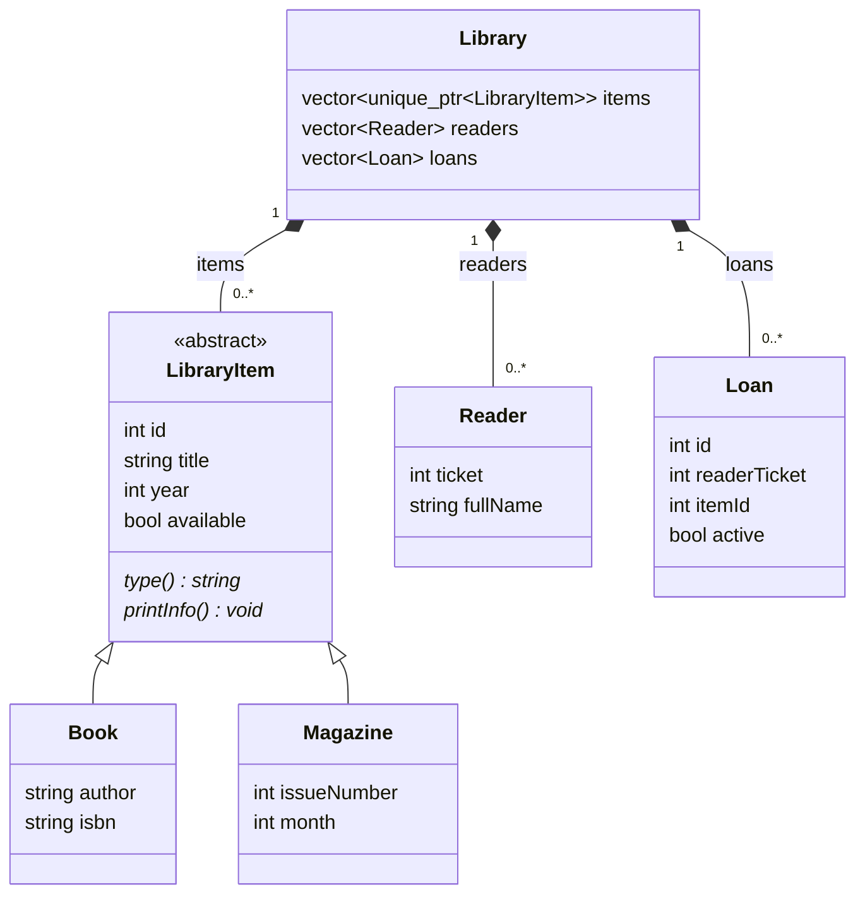

# УП3. Схема классов и словарь данных

| Класс | Поле | Тип C++ | Назначение |
|---|---|---|---|
| LibraryItem | id | int | Уникальный номер издания |
| LibraryItem | title | std::string | Название |
| LibraryItem | year | int | Год 1500–2100 |
| LibraryItem | available | bool | true: доступно, false: выдано |
| Book | author | std::string | Автор |
| Book | isbn | std::string | ISBN, строка сохраняет дефисы и ведущие нули |
| Magazine | issueNumber | int | Положительный номер выпуска |
| Magazine | month | int | Месяц 1–12 |
| Reader | ticket | int | Уникальный положительный билет |
| Reader | fullName | std::string | ФИО |
| Loan | id | int | Уникальный номер выдачи, назначает программа |
| Loan | readerTicket | int | Ссылка на билет читателя |
| Loan | itemId | int | Ссылка на издание |
| Loan | active | bool | true: выдача активна |
| Library | items | std::vector<std::unique_ptr<LibraryItem>> | Полиморфная коллекция книг и журналов |
| Library | readers | std::vector<Reader> | Читатели |
| Library | loans | std::vector<Loan> | История выдач |

Book и Magazine наследуют также все четыре поля LibraryItem. Виртуальный деструктор позволяет безопасно удалять наследников через указатель на базовый класс.
